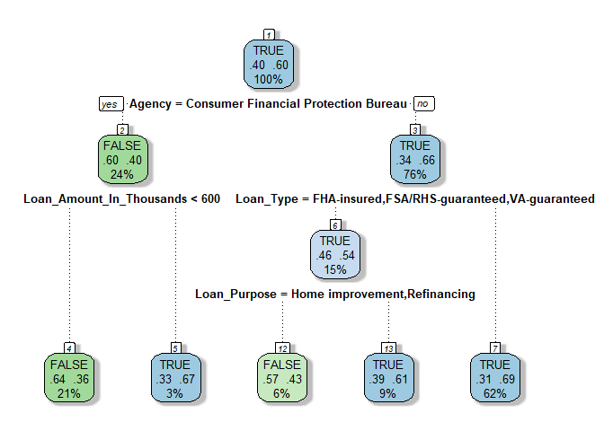
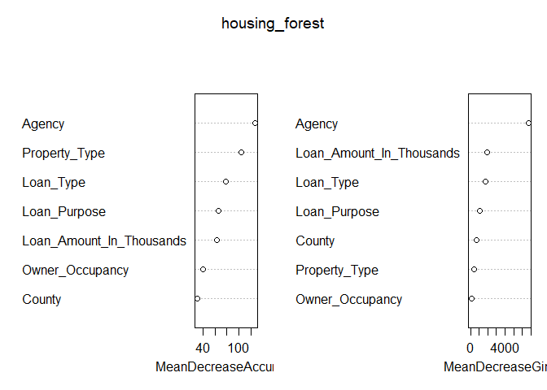
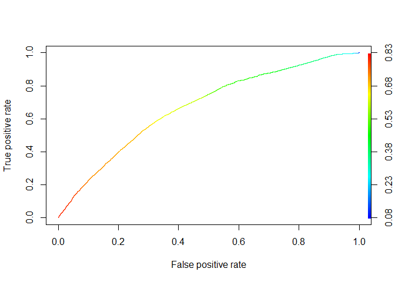

<!-- README.md is generated from README.Rmd. Please edit that file -->

# HousingLoans

<!-- badges: start -->
<!-- badges: end -->

The goal of HousingLoans is to provide housing loan application data for
the year 2017 in the state of Massachusetts.

## Installation

You can install the released version of HousingLoans from
[CRAN](https://CRAN.R-project.org) with:

``` r
install.packages("HousingLoans")
```

And the development version from [GitHub](https://github.com/) with:

``` r
# install.packages("devtools")
devtools::install_github("justniice/HousingLoans")
```

## Modelling

We will attempt to make models to predict whether a housing loan will be
approved based off the variables available in our dataset.

``` r
housing_loans <- read_rds("data-raw/data_clean.rds")
housing_loans$Loan_Accepted <- as.factor(housing_loans$Loan_Accepted)
```

### CART

Begin with a training-test split.

``` r
set.seed(100)
train_and_test <- sample.split(housing_loans$Loan_Accepted, SplitRatio = 0.8)
housing_train <- subset(housing_loans, train_and_test == TRUE)
housing_test <- subset(housing_loans, train_and_test == FALSE)
table(housing_train$Loan_Accepted)
#> 
#>  FALSE   TRUE 
#>  85808 129110
```

A good baseline model which we will use throughout this problem would be
one that always predicts that the loan is accepted, no matter what. This
has an accuracy of $\\frac{129110}{214918} = 60.07\\%$ on the training
set.

``` r
housing_tree <- rpart(Loan_Accepted ~ ., data =
        select(housing_train, -Preapproval), method = "class")
fancyRpartPlot(housing_tree, caption = NULL)
```



``` r
training_results <- predict(housing_tree, newdata = housing_train, type = "class")
housing_train$predictions <- training_results
conf_mat(housing_train, truth = Loan_Accepted, estimate = predictions)
#>           Truth
#> Prediction  FALSE   TRUE
#>      FALSE  35670  21235
#>      TRUE   50138 107875
```

We have a classification tree with an accuracy of
$\\frac{35670 + 107875}{214918} = 66.79\\%$ on the training set, which
is a slight improvement from the baseline model.

``` r
housing_test$predictions <- predict(housing_tree, newdata = housing_test, type = "class")
conf_mat(housing_test, truth = Loan_Accepted, estimate = predictions)
#>           Truth
#> Prediction FALSE  TRUE
#>      FALSE  8828  5344
#>      TRUE  12624 26934
```

We have an accuracy of $\\frac{8828+26934}{53729} = 66.56\\%$, while the
baseline accuracy is 60.07%. There is no evidence of overfitting since
the accuracy on the training and test sets are comparable, and the model
does represent some improvement over the baseline on the testing set.

### Random Forest

Begin with a training-test split.

``` r
set.seed(123)
train_and_test <- sample.split(housing_loans$Loan_Accepted, SplitRatio = 0.8)
housing_train <- subset(housing_loans, train_and_test == TRUE)
housing_test <- subset(housing_loans, train_and_test == FALSE)
table(housing_train$Loan_Accepted)
#> 
#>  FALSE   TRUE 
#>  85808 129110
```

``` r
housing_forest <- randomForest(Loan_Accepted ~ .,
  data =
    select(housing_train, -Preapproval), ntree = 300, importance = TRUE
)
```

``` r
varImpPlot(housing_forest)
```



The random forest classifier identifies the Agency variable and the
characteristics of the loan: size, type and purpose as the most
important predictor variables, which is similar to the CART model.

Check the performance on the training data:

``` r
housing_train$predictions <- predict(housing_forest, newdata = housing_train)
conf_mat(housing_train, truth = Loan_Accepted, estimate = predictions)
#>           Truth
#> Prediction  FALSE   TRUE
#>      FALSE  35450  19831
#>      TRUE   50358 109279
```

Check the performance on the testing data:

``` r
housing_test$predictions <- predict(housing_forest, newdata = housing_test)
conf_mat(housing_test, truth = Loan_Accepted, estimate = predictions)
#>           Truth
#> Prediction FALSE  TRUE
#>      FALSE  8828  5003
#>      TRUE  12624 27275
```

The random forest model obtains an accuracy of 67.34% on the training
set and 67.19 on the testing set. This is marginally better than the
CART model, but it is more computationally intensive. It also has less
explanatory power since it is a black box model.

### Logistic Regression

Once more, with a logistic regression model.

``` r
set.seed(456)
train_and_test <- sample.split(housing_loans$Loan_Accepted, SplitRatio = 0.8)
housing_train <- subset(housing_loans, train_and_test == TRUE)
housing_test <- subset(housing_loans, train_and_test == FALSE)
table(housing_train$Loan_Accepted)
#> 
#>  FALSE   TRUE 
#>  85808 129110
```

``` r
housing_logit <- glm(Loan_Accepted ~ .,
  data =
    select(housing_train, -Preapproval), family = "binomial"
)
```

Check the performance on the training data:

``` r
housing_predict <- predict(housing_logit,
  newdata =
    housing_train, type = "response"
)
table(housing_train$Loan_Accepted, housing_predict > 0.5)
#>        
#>          FALSE   TRUE
#>   FALSE  37080  48728
#>   TRUE   24576 104534
```

Check the performance on the testing data:

``` r
housing_predict <- predict(housing_logit,
  newdata =
    housing_test, type = "response"
)
table(housing_test$Loan_Accepted, housing_predict > 0.5)
#>        
#>         FALSE  TRUE
#>   FALSE  9304 12148
#>   TRUE   6195 26083
ROCRpred <- prediction(housing_predict, housing_test$Loan_Accepted)
ROCRperf <- performance(ROCRpred, "tpr", "fpr")
plot(ROCRperf, colorize = TRUE)
```



The glm model does not perform as well on the training and testing sets
as the other models. The accuracy on the training set is 65.89% and the
accuracy on the testing set is 65.86%. The glm model easily lends itself
to interpretation, since we can use summary() to attempt to identify
variables that are strongly correlated with approval rate. However,
almost all our predictor variables are factors with multiple levels, and
within each factor, it is difficult for the model to distinguish which
levels are truly significant predictors.

## Analysis

The three different models we used all have similar accuracies of around
66% on both training and testing data, suggesting that they are not
overfitted, and that there is no one model that is clearly better than
the others at predicting the outcome variable. There is a slight
trade-off between ease of interpretation and accuracy, since the model
that performed the best, the random forest model, is a black-box model,
while it is much easier to interpret which variables are significant
from the glm and CART models. In particular, the CART model offers a few
pieces of information as to which factors are strong predictors of loan
approval rate. Based off the CART model plot, loans are much more likely
to be rejected if the application is made to the CFPB and the loan is
relatively small (&lt;$600,000). Similarly, the random forest and glm
models also suggest that the loan approval rate depends very strongly on
which agency is considering the loan application. The CART models also
suggest that loans guaranteed by other institutions are more likely to
be approved. This is a logical conclusion to draw since the risk to the
originating institution is much lower when the loan is guaranteed, but
is not particularly useful information. On the other hand, referencing
the CART model again and noting that Loan\_Purpose is a factor with only
three levels, home improvement, refinancing and home purchase, it would
appear that home purchase loans are also significantly more likely to be
denied than other loans. This is possibly because consumers who already
own homes are more financially stable and are hence more likely to be
approved for loans than consumers who are attempting to obtain loans to
purchase a home. Combined with the fact that it is smaller loans that
are likely to be rejected, it is likely that consumers with lower
purchasing power and consumers seeking to buy a house rather than
improve one they already own find it harder to get approval for a
housing loan. Unfortunately, this group of consumers is also probably
the one that needs such loans the most.
